<div align="center">


<a href="https://www.linkedin.com/in/mgnischor/"></a>
<a href="https://github.com/mgnischor"></a>
<a href="mailto:miguel@nischor.com.br"></a>

<br/>

[](https://git.io/typing-svg)

</div>

---

## 🧠 Sobre mim

Engenheiro da Computação com **13+ anos de experiência em TI**, transitando por infraestrutura, gestão e desenvolvimento — o que me confere uma visão sistêmica, rara e valiosa no ciclo de vida de soluções digitais.

Especialista em **Arquitetura de Software Distribuído** (PUC Minas) com sólida base em engenharia de negócios e DevOps. Atualmente aprofundo fundamentos em **Matemática** (UNINTER) e **Engenharia DevOps** (IFMT).

**O que trago para um time:**

- 🏗️ **Arquitetura** — Desenho de sistemas distribuídos resilientes, escaláveis e orientados a domínio
- ⚙️ **DevOps** — Construção e evolução de pipelines CI/CD, IaC com Terraform e orquestração com Kubernetes
- ☁️ **Cloud** — Soluções em AWS e Azure com foco em custo, segurança e performance
- 🎯 **Visão de negócio** — Tradução de requisitos de negócio em decisões técnicas com impacto real
- 🧑‍🏫 **Liderança técnica** — Mentoria, revisão de código e elevação do nível técnico das equipes

---

## 🏆 Certificações

<div align="center">

[](https://aws.amazon.com/certification/certified-developer-associate/)


</div>

---

## 🎓 Formação Acadêmica

<div align="center">

| Grau | Curso | Instituição | Status |
|:---:|---|---|:---:|
| 🎓 | Engenharia da Computação | UNINTER | ✅ Concluído |
| 📘 | Pós-graduação — Engenharia de Negócios | UNINTER | ✅ Concluído |
| 📘 | Pós-graduação — Arquitetura de Software Distribuído | PUC Minas | ✅ Concluído |
| 📘 | Pós-graduação — Engenharia DevOps | IFMT | 🔄 Em andamento |
| 📖 | Bacharelado em Matemática | UNINTER | 🔄 Em andamento |

</div>

---

## 🛠️ Stack Tecnológico

<div align="center">

**Linguagens**


**Cloud & DevOps**


**Dados & Mensageria**


**Ferramentas**


</div>

---

## � Projetos em Destaque

<div align="center">

<a href="https://github.com/mgnischor/ecommerce-backend">
  
</a>
<a href="https://github.com/mgnischor/ecommerce-frontend">
  
</a>

</div>

<br/>

### 🏗️ Arquitetura & Backend

| Projeto | Descrição | Stack |
|---|---|---|
| [**🔗 E-Commerce (Backend)**](https://github.com/mgnischor/ecommerce-backend) | Backend para um sistema de e-commerce completo, incluindo operações financeiras, contábeis e de estoque | `.NET` `PostgreSQL` `Docker` |
| [**🔗 E-Commerce (Frontend)**](https://github.com/mgnischor/ecommerce-frontend) | Frontend para um sistema de e-commerce, seguindo boas práticas de UI/UX, responsividade e acessibilidade | `Angular` `TypeScript` `RxJs` |

---

## �📊 GitHub Stats

<div align="center">





</div>

---

## 📌 Áreas de Especialização

```text
├── Backend Development
│   ├── APIs RESTful e gRPC com .NET / Python
│   ├── Arquitetura Hexagonal, Clean Architecture, DDD
│   └── CQRS, Event Sourcing, Saga Pattern
│
├── Cloud & Infraestrutura
│   ├── AWS (Lambda, ECS, RDS, SQS, API Gateway)
│   ├── Azure (AKS, App Service, Service Bus)
│   └── IaC com Terraform + GitOps
│
└── Observabilidade & Qualidade
    ├── Monitoramento com Prometheus + Grafana
    ├── Distributed Tracing (OpenTelemetry)
    └── Testes automatizados e pipelines CI/CD
```

---

<div align="center">

*"O compartilhamento de conhecimento é o motor da evolução em equipes técnicas."*

<br/>


</div>
